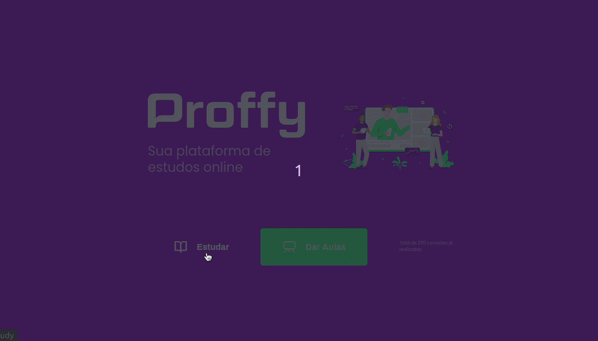

<h1 align="center">Projeto Happy da NLW #03</h1>

Proffy é uma aplicação com o facilitar a o acesso a aulas particulares

## Tecnologias utilizadas:

- [Node.js](https://nodejs.org/en/)
- [Javascript](https://developer.mozilla.org/)
- [HTML 5](https://developer.mozilla.org/pt-BR/docs/Web/HTML)
- [CSS 3](https://developer.mozilla.org/pt-BR/docs/Web/CSS)
- [Nunjucks](https://mozilla.github.io/nunjucks/)

## Como Utilizar

- Clone o projeto no seu computador
- Instale as dependências com o comando (npm install)
- Acesse no navegador no (http://localhost:5500)

Projeto feito com o objetivo de ter uma visão gerão e prática dos conceitos de HTML, CSS e JS.
